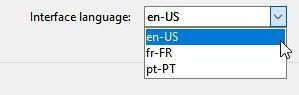
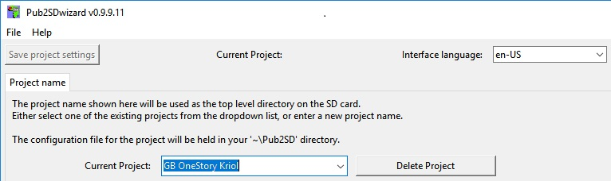

========
Usage
========

From commandline::

    Usage: python3 BibTerms2Dict.py
    
From desktop (Windows 64bit binary), double-click on the Pub2SDwizard icon.

.. image:: images/mainq.png
   :width: 57
   :alt: BibTerms2Dict icon

This will open the main window which will contain the pulldown list for the gui-interface language, 
a button for saving the project and the tab base display for the rest of the program. 
There will also be a menu bar, giving access to 'File|Save project', 'Help|Usage instructions' and 
a 'Help|About' dialog holding copyright info etc...

Which interface language?
------------------------------
Your first choice is which interface language you wish to work with. 
The gui interface language can be selected from the drop-down list at the top right of the screen and 
can be changed at any time.

This will default to English.

Next visit the BibTerms2Dict tab based interface, it is expected that you will be able to move 
backwards and forwards between tabs. Though the 'Setup' tab should always be completed first 
before any other tabs can be displayed. All project settings can be saved at any time with either the same 
or different project names and reloaded when BibTerms2Dict is launched. So the contents of the setup tab 
should not be changed after they have been applied.

The Setup tab
------------------------------

The project name can either be entered directly or chosen from the drop-down list. 
The project settings can be saved at any time and will be held in a '<project name>.prj' file stored in a 
'BibTerms2Dict' folder under your home folder (i.e. 'C:\Users\<username>\BibTerms2Dict' on Windows 
or '~/BibTerms2Dict' on Linux). 
The project file will hold all the settings and results of any decisions made. 
No other files will be created until specified on the 'Output' tab.

On the 'Setup' tab specify/browse to:
  - The dictionary file exported from 'Map Creator'. This holds the 'source' language term (typically English) 
and the 'fallback' language term (typically the national language). 
N.B Where both latin and complex scripts are used the national language should be used as the 'fallback' to 
create the latin dictionary. Then the latin dictionary will be used as the 'fallback' for the complex script.

  - The html file exported from the Paratext Biblical Terms tool. This will contain the list of 
terms in the 'source' language and their corresponding entries in the 'target' or venacular language.

  - An existing dictionary file for your target lnguage exported from Map Creator with the same source language. 
Any source/target (key, value) pairs of terms from the existing dictionary which do not conflict with the 
new list of terms will be loaded into the list on the Approved tab. Any conflicts between the exiting Map Creator 
dictionary and your new list of biblical terms will be displayed on the 'Conflicts' tab.

  - An option to add source terms for fields required for inclusion in CLDR. 
(e.g. months, days of the week and their abbreviations if any, etc...) With a sub option to specify locations of 
Paratext/Flex projects which can be mined for this and other data.

There be an 'Apply' button which will load the above specifcations and enable/unhide the other tabs. 
(While disabling the 'setup' tab?)

The following tabs will be available:

 - 'Transliteration' This will hold a text box specifying the transliteration from the 'fallback' language to 
the 'target' language (in x/y pairs of strings, characters may be entered directly or 
using the 0xNNNN notation for their unicode values). Which may be used to create initial entries for terms not 
held in the Paratext project files. Entries will be processed in a longest first sort order.
(e.g. country names for world maps).

  - 'Terms' This will hold a treeview of all the terms and renderings which have been loaded, divided into sections 
(Approved, Conflicts, Suggestions, Unknown and CLDR).
There will be x buttons to  select the desired view.

     - 'Show all' showing allterms and their possible renderings.

     - 'Approved' showing all currently approved 'source'/'target' pairs. 
Biblical terms which have a single rendering and no conflict with a existing dictionary rendering 
will automaticly be shown as approved.

     - 'Conflicts' showing all terms which have confilcting renderings between the  old source/target dictionary 
and the new set of biblical terms from Paratext or the new source/fallback dictionary.

     - 'Suggestions' showing all unapproved terms, which have multiple possibel renderings. 
(note additional renderings may be suggested for terms without any renderings, based on the occurance 
of words in the source term within other approved terms.)

     - 'Unknown' showing all terms with no suggested rendering. These will normally have the 
fallback (national/regional) languge term shown.
Additional buttons on this tab will allow selected renderings to be applied to their term, hiding the alternatives. 
Renderings for a selected term may be entered directly or taken from the fallback rendering (with or without) transliteration.

     - 'CLDR'  button will show the remaining unknown terms required for submission to prepare an application 
to include the language in the 
Common Language Data Repository. With supporting dialogs for mining Paratext or Flex projects writing systems.
(In order that future versions of software like LO and MS Word will 
have a spelling dictionary slot for the target language.)

     - 'Output' (or Save Approved terms) button will open a filedialog asking where to  save the created dictionary 
file for import to 'Map Creator'. The created dictionary file will by default have blank enties for target terms which have not 
been specified. There will also be an option to fill any blank target entries with their corresponding fallback term.

